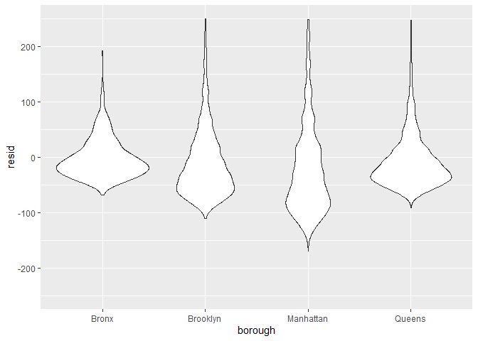

linear_models
================

``` r
data("nyc_airbnb")

nyc_airbnb = 
  nyc_airbnb %>% 
  mutate(stars = review_scores_location / 2) %>% 
  rename(
    borough = neighbourhood_group,
    neighborhood = neighbourhood) %>% 
  filter(borough != "Staten Island") %>% 
  select(price, stars, borough, neighborhood, room_type)
```

fit the first model

``` r
fit = lm(price ~ stars + borough, data = nyc_airbnb)

fit
```

    ## 
    ## Call:
    ## lm(formula = price ~ stars + borough, data = nyc_airbnb)
    ## 
    ## Coefficients:
    ##      (Intercept)             stars   boroughBrooklyn  boroughManhattan  
    ##           -70.41             31.99             40.50             90.25  
    ##    boroughQueens  
    ##            13.21

``` r
summary(fit)
```

    ## 
    ## Call:
    ## lm(formula = price ~ stars + borough, data = nyc_airbnb)
    ## 
    ## Residuals:
    ##    Min     1Q Median     3Q    Max 
    ## -169.8  -64.0  -29.0   20.2 9870.0 
    ## 
    ## Coefficients:
    ##                  Estimate Std. Error t value Pr(>|t|)    
    ## (Intercept)       -70.414     14.021  -5.022 5.14e-07 ***
    ## stars              31.990      2.527  12.657  < 2e-16 ***
    ## boroughBrooklyn    40.500      8.559   4.732 2.23e-06 ***
    ## boroughManhattan   90.254      8.567  10.534  < 2e-16 ***
    ## boroughQueens      13.206      9.065   1.457    0.145    
    ## ---
    ## Signif. codes:  0 '***' 0.001 '**' 0.01 '*' 0.05 '.' 0.1 ' ' 1
    ## 
    ## Residual standard error: 181.5 on 30525 degrees of freedom
    ##   (9962 observations deleted due to missingness)
    ## Multiple R-squared:  0.03423,    Adjusted R-squared:  0.03411 
    ## F-statistic: 270.5 on 4 and 30525 DF,  p-value: < 2.2e-16

``` r
fit %>% 
  broom::tidy() %>% 
  mutate(term = str_replace(term, "borough", "Borough:")) %>% 
  select(term, estimate, p.value) %>% 
  knitr::kable(digits = 2)
```

| term              | estimate | p.value |
|:------------------|---------:|--------:|
| (Intercept)       |   -70.41 |    0.00 |
| stars             |    31.99 |    0.00 |
| Borough:Brooklyn  |    40.50 |    0.00 |
| Borough:Manhattan |    90.25 |    0.00 |
| Borough:Queens    |    13.21 |    0.15 |

## change reference category

``` r
fit = nyc_airbnb %>% 
  mutate(borough = fct_infreq(borough)) %>% 
  lm(price ~ stars + borough, data = .)

fit %>% 
  broom::tidy() %>% 
  mutate(term = str_replace(term, "borough", "Borough:")) %>% 
  select(term, estimate, p.value) %>% 
  knitr::kable(digits = 2)
```

| term             | estimate | p.value |
|:-----------------|---------:|--------:|
| (Intercept)      |    19.84 |     0.1 |
| stars            |    31.99 |     0.0 |
| Borough:Brooklyn |   -49.75 |     0.0 |
| Borough:Queens   |   -77.05 |     0.0 |
| Borough:Bronx    |   -90.25 |     0.0 |

``` r
fit %>% 
  broom::glance()
```

    ## # A tibble: 1 × 12
    ##   r.squared adj.r.…¹ sigma stati…²   p.value    df  logLik    AIC    BIC devia…³
    ##       <dbl>    <dbl> <dbl>   <dbl>     <dbl> <dbl>   <dbl>  <dbl>  <dbl>   <dbl>
    ## 1    0.0342   0.0341  182.    271. 6.73e-229     4 -2.02e5 4.04e5 4.04e5  1.01e9
    ## # … with 2 more variables: df.residual <int>, nobs <int>, and abbreviated
    ## #   variable names ¹​adj.r.squared, ²​statistic, ³​deviance

## Diagnostics

``` r
modelr::add_residuals(nyc_airbnb, fit) %>% 
  ggplot(aes(x = stars, y = resid)) +
  geom_point()
```

    ## Warning: Removed 9962 rows containing missing values (geom_point).

<!-- -->

``` r
nyc_airbnb %>% 
  modelr::add_residuals(fit) %>% 
  ggplot(aes(x = borough, y = resid)) +
  geom_violin() +
  ylim(-250, 250)
```

    ## Warning: Removed 10862 rows containing non-finite values (stat_ydensity).

<!-- -->

## Hypothesis testing

one coefficient - stars

``` r
fit %>% 
  broom::tidy()
```

    ## # A tibble: 5 × 5
    ##   term            estimate std.error statistic   p.value
    ##   <chr>              <dbl>     <dbl>     <dbl>     <dbl>
    ## 1 (Intercept)         19.8     12.2       1.63 1.04e-  1
    ## 2 stars               32.0      2.53     12.7  1.27e- 36
    ## 3 boroughBrooklyn    -49.8      2.23    -22.3  6.32e-109
    ## 4 boroughQueens      -77.0      3.73    -20.7  2.58e- 94
    ## 5 boroughBronx       -90.3      8.57    -10.5  6.64e- 26

``` r
fit_null = lm(price ~ stars, data = nyc_airbnb)
fit_alt = lm(price ~ stars + borough, data = nyc_airbnb)

anova(fit_null, fit_alt) %>% 
  broom::tidy()
```

    ## Warning: Unknown or uninitialised column: `term`.

    ## # A tibble: 2 × 7
    ##   term                    df.residual       rss    df   sumsq stati…¹    p.value
    ##   <chr>                         <dbl>     <dbl> <dbl>   <dbl>   <dbl>      <dbl>
    ## 1 price ~ stars                 30528    1.03e9    NA NA          NA  NA        
    ## 2 price ~ stars + borough       30525    1.01e9     3  2.53e7    256.  7.84e-164
    ## # … with abbreviated variable name ¹​statistic

## Room type by borough

Interaction…?

``` r
fit = nyc_airbnb %>% 
  lm(price ~ stars + borough * room_type, data = .)

fit %>% 
  broom::tidy()
```

    ## # A tibble: 13 × 5
    ##    term                                   estimate std.error statistic  p.value
    ##    <chr>                                     <dbl>     <dbl>     <dbl>    <dbl>
    ##  1 (Intercept)                                13.1     18.3      0.718 4.73e- 1
    ##  2 stars                                      21.8      2.42     8.97  3.06e-19
    ##  3 boroughBrooklyn                            52.8     14.9      3.54  4.07e- 4
    ##  4 boroughManhattan                          108.      14.9      7.27  3.78e-13
    ##  5 boroughQueens                              21.7     15.7      1.38  1.67e- 1
    ##  6 room_typePrivate room                     -53.0     17.8     -2.99  2.82e- 3
    ##  7 room_typeShared room                      -68.5     41.5     -1.65  9.91e- 2
    ##  8 boroughBrooklyn:room_typePrivate room     -39.2     18.0     -2.17  2.98e- 2
    ##  9 boroughManhattan:room_typePrivate room    -71.6     18.0     -3.98  7.03e- 5
    ## 10 boroughQueens:room_typePrivate room       -15.6     19.0     -0.820 4.12e- 1
    ## 11 boroughBrooklyn:room_typeShared room      -37.3     42.9     -0.869 3.85e- 1
    ## 12 boroughManhattan:room_typeShared room     -85.4     42.4     -2.01  4.41e- 2
    ## 13 boroughQueens:room_typeShared room        -24.6     44.3     -0.555 5.79e- 1

so… can we fit models by borough?

``` r
nest_lm_res =
  nyc_airbnb %>% 
  nest(df = -borough) %>% 
  mutate(
    models = map(.x = df, ~lm(price ~ stars + room_type, data = .x)),
    results = map(models, broom::tidy)) %>% 
  select(-df, -models) %>% 
  unnest(results)
```
